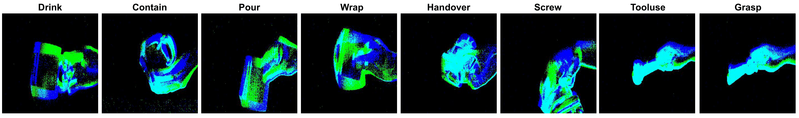

# EHoI: A Benchmark for Task-oriented Hand-Object Interaction Recognition Using Event Camera

# Training and Evaluate
* cd  `spikingjelly_pkg/spikingjelly/activation_based/examples` folder, run `python -m spikingjelly.activation_based.examples.classify_hand_object -T 16 -device cuda:0 -b 2 -epochs 100  -data-dir /media/wchen/linHDD/wchen/hand_object/  -amp -cupy  -opt adam -lr 0.001 -j 12`
* Or cd `src` folder, run `.evaluate.sh`
